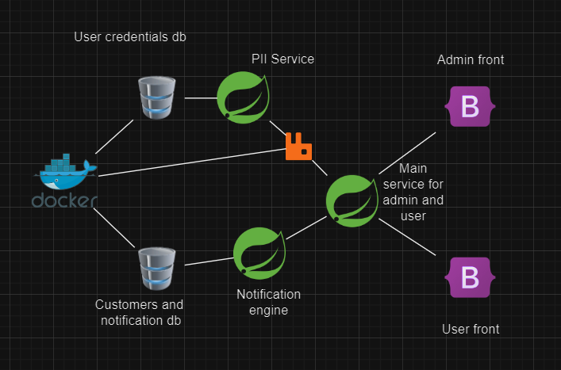

# Notification-Facade-System

## Overview of the entire architecture


This is a guide on how to use this microservice application.
Firstly we'll need to install docker.

1. **Clone the repository:**
    ```bash
    git clone https://github.com/NikaMelashvili/Notification-Facade-System.git
    ```

2. **Setup MySQL with docker:**
    ```bash
    docker pull mysql
    ```
    ```bash
    docker run --name some-mysql -p 3307:3306 -e MYSQL_ROOT_PASSWORD=123 -d mysql:latest
    ```
    ```bash
    docker exec -it some-mysql mysql -uroot -p
    ```
   
3. **Setup RabbitMQ with docker**
     ```bash
    docker pull rabbitmq:management
    ```
    ```bash
    mkdir -p C:\rabbitmq\data
    mkdir -p C:\rabbitmq\logs
    ```
    ```bash
   docker run -d --name rabbitmq -p 5672:5672 -p 15672:15672 -v C:\rabbitmq\data:/var/lib/rabbitmq -v C:\rabbitmq\logs:/var/log/rabbitmq rabbitmq:management
    ```


